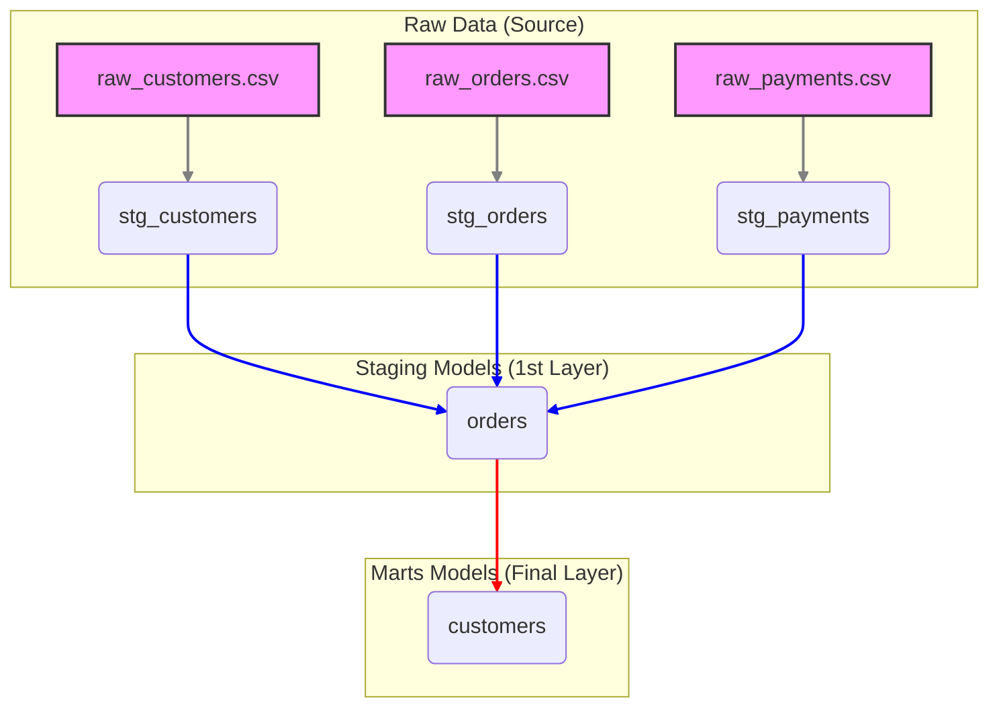

# dbt-jaffle-shop: 아키텍처 분석

## 1. 전체 구조 (디렉토리)

`dbt-jaffle-shop`의 디렉토리 구조는 dbt의 **기능과 데이터 변환 흐름**에 따라 명확하게 역할이 분리되어 있습니다. 이는 데이터 파이프라인을 코드로 관리하기 위한 dbt의 철학을 잘 보여줍니다.

```
dbt-jaffle-shop/
├── models/                 # ⭐ 핵심: 데이터 변환 로직 (SQL 파일)
│   ├── staging/          # 1단계: 원본 데이터 정리 (source-conformed)
│   │   ├── stg_customers.sql
│   │   └── ...
│   └── marts/            # 2단계: 비즈니스 로직 적용 (business-conformed)
│       ├── customers.sql
│       └── ...
│
├── seeds/                  # 원본 데이터 (CSV 파일). dbt seed로 로드
│   └── raw_customers.csv
│
├── macros/                 # 재사용 가능한 SQL 조각 (Jinja 매크로)
│   └── cents_to_dollars.sql
│
├── data-tests/             # (구버전) 커스텀 데이터 테스트
├── analyses/               # 모델을 참조하지만, 실제 생성되지 않는 분석용 SQL
└── dbt_project.yml         # ⚙️ 프로젝트의 모든 설정을 담은 메인 제어 파일
```

## 2. 구조의 목적성: 왜 이런 구조를 선택했는가?

이 프로젝트의 구조는 **데이터의 흐름과 신뢰도**를 단계적으로 구축하기 위해 설계되었습니다. 원본 데이터(raw)에서 최종 분석용 데이터(mart)까지의 과정을 추적 가능하고, 테스트 가능하며, 재사용 가능하게 만드는 것이 핵심 목표입니다.

1.  **계층적 모델링 (`models/staging` -> `models/marts`)**
    *   **`staging`**: 이 단계의 모델들은 원본 데이터 소스 하나와 1:1로 매핑됩니다. 역할은 단지 원본 데이터의 컬럼 이름을 바꾸거나, 타입을 캐스팅하는 등 최소한의 정리 작업에 국한됩니다. 이는 원본 데이터의 변경이 다른 모델에 미치는 영향을 `staging` 단계로 국지화시키는 **방화벽** 역할을 합니다.
    *   **`marts`**: 이 단계에서는 여러 `staging` 모델들을 `join`하고, 복잡한 비즈니스 로직(예: 고객의 생애 가치 계산)을 적용하여 실제 분석에 사용될 최종 데이터셋을 만듭니다. 분석가나 대시보드는 이 `marts` 모델들만 바라보면 됩니다.
    *   **목적**: 데이터 변환 과정을 여러 단계로 분리함으로써, 각 단계의 복잡도를 낮추고, 특정 로직의 변경이 전체 파이프라인에 미치는 영향을 최소화합니다. 이는 **유지보수성과 재사용성**을 극대화합니다.

2.  **데이터와 로직의 분리 (`seeds/` vs `models/`)**
    *   **`seeds/`**: `dbt seed` 명령어로 데이터베이스에 로드될 정적인 원본 데이터(CSV)를 관리합니다. 이는 dbt가 데이터 로더가 아님을 명확히 하면서도, 프로젝트 실행에 필요한 초기 데이터를 코드와 함께 버전 관리할 수 있게 해줍니다.
    *   **`models/`**: 데이터를 어떻게 변환할지에 대한 **로직(SQL)**만을 담고 있습니다. 데이터 자체는 데이터 웨어하우스에 존재합니다.
    *   **목적**: 데이터와 변환 로직을 분리함으로써, 동일한 변환 로직을 다른 환경(개발, 프로덕션)의 다른 데이터에 쉽게 적용할 수 있게 합니다. 이는 **환경 간 일관성**을 보장합니다.

3.  **코드 재사용성 극대화 (`macros/`)**
    *   **`macros/`**: `cents_to_dollars`와 같이 여러 모델에서 반복적으로 사용될 수 있는 SQL 로직을 함수처럼 만들어 관리합니다. (예: `{{ cents_to_dollars('price') }}`)
    *   **목적**: 반복적인 코드를 줄여(DRY: Don't Repeat Yourself) **생산성과 유지보수성**을 높입니다. 매크로 하나만 수정하면 해당 매크로를 사용하는 모든 모델에 변경사항이 일괄 적용됩니다.

4.  **중앙 집중식 설정 (`dbt_project.yml`)**
    *   이 파일은 프로젝트의 모든 것을 제어하는 **두뇌**와 같습니다. 어떤 디렉토리를 모델로 인식할지, 특정 폴더의 모델들은 어떤 방식으로 구체화(`view` 또는 `table`)할지 등을 정의합니다.
    *   **목적**: 프로젝트의 동작 방식을 한 곳에서 명확하게 파악하고 제어할 수 있게 하여 **프로젝트의 예측 가능성과 관리 용이성**을 높입니다.

## 3. 아키텍처 다이어그램 (데이터 흐름)

dbt 프로젝트의 아키텍처는 곧 데이터의 흐름(Lineage)을 의미합니다. `jaffle_shop`의 데이터 흐름은 다음과 같습니다.



- **Raw Data**: `seeds` 디렉토리의 CSV 파일들이나 데이터베이스의 원본 테이블입니다.
- **Staging Models**: 원본 데이터를 1:1로 정리한 뷰(view)들입니다. (`stg_*`)
- **Marts Models**: Staging 모델들을 조합하여 만든 최종 분석용 테이블입니다. 예를 들어, `customers` 모델은 `stg_customers`, `stg_orders`, `stg_payments`를 모두 참조하여 고객별 주문 횟수, 총 결제 금액 등을 계산합니다.